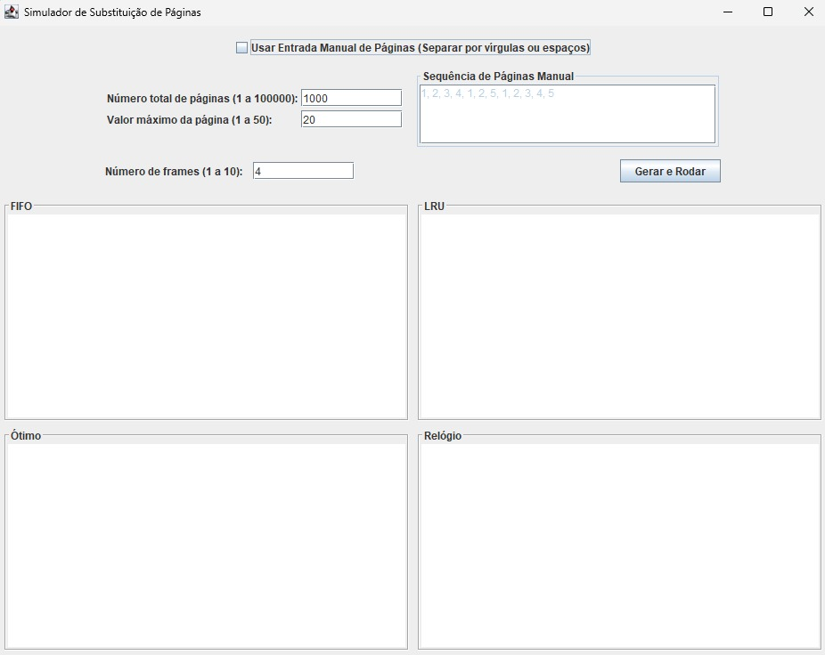

# Simulador de Substituição de Páginas
Este projeto implementa e compara quatro algoritmos de substituição de páginas de memória: FIFO, LRU, Ótimo e Relógio (Segunda Chance).

A simulação utiliza cadeias de referência de página geradas aleatoriamente, permitindo testar a eficiência dos algoritmos em diferentes cenários de carga de trabalho.

## Funcionalidades da Interface (GUI)


### Entrada de Dados

Esta seção permite que o usuário escolha como a sequência de páginas será gerada e defina o número de *frames*.

* **Número de Frames:** Campo obrigatório, define o tamanho da memória fisica. (1 a 10 frames)

* Você pode alternar entre duas formas de fornecer as páginas:
    * **Geração Aleatória (Padrão):** Os campos "Número total de páginas" (1 a 10000) e "Tamanho do espaco de enderecamento virtual" (0 a 20) são utilizados para gerar uma sequência aleatória.
    * **Entrada Manual:** Ao marcar a opção **"Usar Entrada Manual de Páginas"**, os campos aleatórios são desabilitados, e uma área de texto é habilitada para que você insira a sequência de páginas, separando os números por **vírgulas** ou **espaços**.

* **Botão "Gerar e Rodar":** Inicia o processamento. Ao clicar, o programa solicita o local para salvar o arquivo de log e, em seguida, executa os quatro algoritmos.

### Resultados
A parte central da janela é dividida em quatro painéis, cada um exibindo o log dos algoritmos:

* **FIFO (First-In, First-Out)**
* **LRU (Least Recently Used)**
* **Ótimo (Optimal)**
* **Relógio (Clock)**

Cada painel exibe a **sequência de páginas de entrada** no topo, seguida pelo log detalhado da atividade de cada algoritmo.

## Pré-requisitos
Para compilar e executar este projeto, você precisará ter o seguinte instalado:

* Java 8 ou superior.

## Estrutura do Projeto
```
|-- bin/                        # Armazena os arquivos .class
|-- src/                        
|   |-- Main.java               # Inicializa a aplicacao
|   |-- PageReplacement.java    # Logica dos algoritmos
|   |-- PageReplacementGUI.java # Interface grafica
|-- README.md
```

## Compilar e Rodar
Crie uma pasta para armazenar o código compilado (`.class`):
```shell
mkdir bin
```
Em seguida, compile os arquivos `.java`:
```shell
javac -d bin src/*.java
```

Rodar o Programa:
```shell
java -cp bin Main
```

